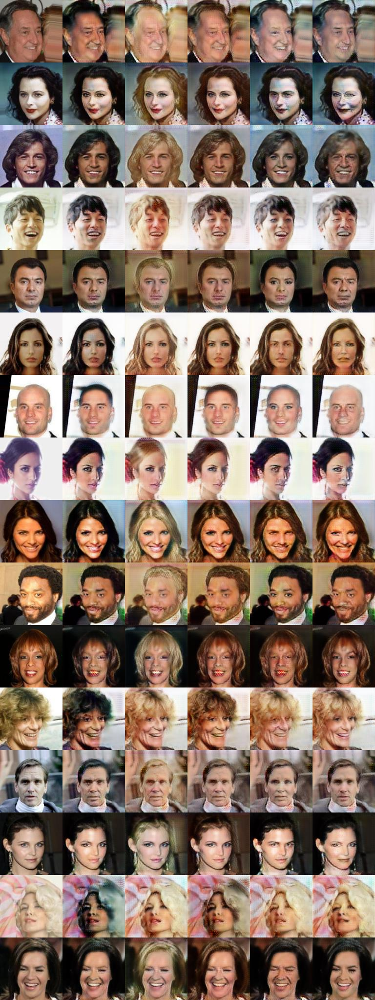

# Phase 1

Run the code provided with the paper.

**Results:**

### Using GPU

- I configured my laptop to run pyTorch and TensorFlow on my GPU and documented all the steps.
- My GPU is NVidia GeForce GT 755M with compute compatibility 3.0
- Finally pyTorch told me that this specific GPU is old and they droped it from their binaries but I can still use it if I build pyTorch from source

### Using CPU

- I configured my laptop to run pyTorch and TensorFlow on CPU and documented all the steps
- I have intel core i7-4700MQ @ 2.4 GHz with 16GB RAM
- One batch on this pc takes around 1 minute and requires a peak of 11GB of RAM (just for this python process not including other applications)
- The required 200,000 iterations to get the same results of the paper would have taken around 140 days

### Using Colab

- I configured Colab to StarGAN code with one dataset (CelebA).
- One batch would take 8 seconds with total of 44 hours to complete the 200,000 iterations
- I make it run for 20,000 iterations taking around 4 hours and saved the model and the sample output images.
- The sample images showed similar characteristics approaching the ones provided in the paper but with lower quality. (Because GAN hasn't been trained enough)

**Sample:**

| Original | Black Hair | Blond Hair | Brown Hair | Male | Young |
|----------|------------|------------|------------|------|-------|

# Phase 2

Understand how GANs work and reimplement the same idea elaborated in the paper in a generic way making a library that can be used with multiple datasets. In contrast with the code provided with the paper, which has many lines related to those specific datasets used to show off the work of the paper.

**Deliverable:** Python library with documentation for how to use it to train a StarGAN

**Estimated:** two weeks

# Phase 3

Use the developed library to get the same results of the paper.

Three variations of training are doumented in the paper:
- CelebA only
- RaFD only
- CelebA with RaFD

**Deliverable:** Sample output images and the trained model for each case.

**Estimated:** two weeks

# Bonus Phase 4

Search for other datasets that would be useful to train a StarGAN to apply image-to-image transformations on them.

If a suitable dataset is found, try to train a StarGAN on that dataset.
